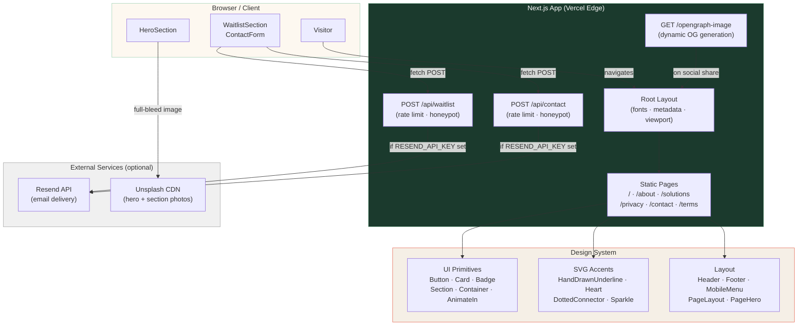

# Igniwave

**Privacy-First Wellness Intelligence Platform**

> Connect your health data. See what matters. Share with your care team — on your terms.

[](https://matt-site-ten.vercel.app)
[](https://nextjs.org)
[](https://www.typescriptlang.org)
[](https://tailwindcss.com)

---

## Overview

Igniwave is a consumer-controlled wellness intelligence platform. It fuses wearable signals (sleep, activity, HRV, heart rate) into a unified 30-day timeline, surfaces plain-language insights about what changed and why it matters, and generates consented **Visit Share Packs** — one-page PDFs patients can hand to any provider before their next appointment.

**Core principles:**
- **Privacy as architecture** — data is encrypted client-side; we store ciphertext only, never raw health data
- **Consumer control** — every share is user-initiated with explicit scope, recipient, and expiration
- **No clinical entanglement** — V1 is a consumer tool; providers receive exports, not portal access

This repository contains the **marketing and waitlist site** — the public-facing web presence built to communicate the product vision, collect early-access signups, and establish trust with individuals, families, and care teams.

---

## Tech Stack

| Layer | Technology | Version |
|---|---|---|
| Framework | Next.js App Router | 16.1.6 |
| Language | TypeScript (strict) | ^5 |
| Styling | Tailwind CSS v4 | ^4 |
| Animations | Framer Motion | ^12 |
| Icons | Lucide React | ^0.577 |
| Fonts | DM Serif Display, Plus Jakarta Sans, JetBrains Mono | via `next/font/google` |
| Utilities | clsx + tailwind-merge | latest |
| Deployment | Vercel | — |

> **Note:** Tailwind v4 uses a CSS `@theme` block instead of `tailwind.config.ts`. All design tokens live in `src/app/globals.css`. The `@theme` and `@apply` warnings in VS Code are IDE false positives — `npm run build` is always clean.

---

## Project Structure

```
src/
├── app/                        # Next.js App Router
│   ├── layout.tsx              # Root layout: fonts, global metadata, viewport
│   ├── page.tsx                # Homepage (Hero → Problem → Solution → Features → Trust → Privacy → Waitlist)
│   ├── loading.tsx             # Global loading UI (cream spinner)
│   ├── not-found.tsx           # Branded 404 page
│   ├── globals.css             # Tailwind @theme tokens + base layer
│   ├── opengraph-image.tsx     # Dynamic OG image generation
│   ├── about/page.tsx          # About — mission, approach, roadmap
│   ├── solutions/page.tsx      # Solutions — individuals, clinicians, families
│   ├── privacy/page.tsx        # Privacy — 4 pillars, data table, compliance
│   ├── contact/
│   │   ├── page.tsx            # Contact page — 2-col layout + FAQ
│   │   └── ContactForm.tsx     # Client component: form state, validation, API call
│   ├── terms/page.tsx          # Terms of Service — 9 sections
│   └── api/
│       ├── waitlist/route.ts   # POST /api/waitlist — email capture + Resend
│       └── contact/route.ts    # POST /api/contact — contact form + Resend notify
│
├── components/
│   ├── layout/
│   │   ├── Header.tsx          # Sticky nav, skip-to-content, scroll state, safe-area
│   │   ├── Footer.tsx          # Footer with CTA strip, nav columns, social icons
│   │   ├── MobileMenu.tsx      # Full-screen overlay: focus trap, scroll lock, Escape
│   │   └── PageLayout.tsx      # Wrapper: Header + <main id="main-content"> + Footer
│   │
│   ├── sections/               # Homepage section components
│   │   ├── HeroSection.tsx     # Full-bleed Unsplash hero with animated headline + scroll cue
│   │   ├── ProblemSection.tsx  # 3 pain cards with HandDrawnArrow connectors
│   │   ├── SolutionSection.tsx # 3-step "How It Works" with DottedConnector + stock photo
│   │   ├── FeaturesSection.tsx # 6-card feature grid with SparkleAccent
│   │   ├── TrustSection.tsx    # 2-col trust: trust badges + stock photo + pull quote
│   │   ├── PrivacySection.tsx  # 4-pillar privacy section on forest background
│   │   ├── WaitlistSection.tsx # Email capture form with validation + success state
│   │   └── PageHero.tsx        # Reusable page hero (bg-forest, HandDrawnUnderline)
│   │
│   ├── ui/                     # Design system primitives
│   │   ├── AnimateIn.tsx       # Framer Motion scroll-reveal (hydration-safe)
│   │   ├── Badge.tsx           # default/accent/outline/v2/success variants
│   │   ├── Button.tsx          # primary/secondary/ghost/outline × sm/md/lg + buttonVariants()
│   │   ├── Card.tsx            # default/elevated/bordered/dark + hover lift
│   │   ├── Container.tsx       # default/narrow/wide max-width wrapper
│   │   ├── Input.tsx           # Label, hint, error, ARIA
│   │   ├── Section.tsx         # cream/warm/forest/white background sections
│   │   └── SectionHeading.tsx  # eyebrow + title + description + optional accent
│   │
│   └── icons/
│       ├── IgniwaveLogo.tsx    # full/mark × dark/light × sm/md/lg
│       ├── HandDrawnUnderline.tsx
│       ├── HandDrawnCircle.tsx
│       ├── HandDrawnArrow.tsx
│       ├── HandDrawnHeart.tsx
│       ├── DottedConnector.tsx
│       ├── SparkleAccent.tsx
│       ├── LeafAccent.tsx
│       ├── SquiggleDivider.tsx
│       └── features/           # Custom SVG icons for each product feature
│
├── config/
│   └── site.ts                 # siteConfig: name, tagline, navLinks, CTAs, social URLs
│
└── styles/
    └── fonts.ts                # next/font/google: DM Serif Display, Plus Jakarta Sans, JetBrains Mono
```

---

## Pages & Routes

| Route | Type | Description |
|---|---|---|
| `/` | Static | Homepage — full section sequence |
| `/about` | Static | Mission, 3-pillar approach, 4-phase roadmap |
| `/solutions` | Static | For individuals, clinicians, and families |
| `/privacy` | Static | Privacy pillars, data table, V1 compliance |
| `/contact` | Static | Contact form + info + FAQ |
| `/terms` | Static | Terms of Service |
| `/api/waitlist` | Dynamic | `POST` — email capture with rate limiting + optional Resend |
| `/api/contact` | Dynamic | `POST` — contact form with rate limiting + optional Resend notify |
| `/not-found` | Static | Branded 404 with home + contact CTAs |

---

## Getting Started

### Prerequisites

- Node.js 18.17+ (LTS recommended)
- npm 9+ (or pnpm / yarn)

### Installation

```bash
git clone https://github.com/HiNala/Igniwave.git
cd Igniwave
npm install
```

### Development

```bash
npm run dev
```

Open [http://localhost:3000](http://localhost:3000). The site uses Turbopack by default in dev.

### Build

```bash
npm run build    # Production build (Next.js + Turbopack)
npm run start    # Start production server locally
```

### Lint & Type Check

```bash
npm run lint          # ESLint (eslint-config-next + TypeScript rules)
npx tsc --noEmit      # TypeScript strict mode check
```

Both must exit with code 0 before any production deploy.

---

## Environment Variables

The site works out of the box without any environment variables. All API routes gracefully degrade when email services are unconfigured — submissions are logged to the console instead.

To activate email delivery, set the following in Vercel (or `.env.local` for local dev):

```bash
# Resend — email delivery for waitlist + contact notifications
RESEND_API_KEY=re_xxxxxxxxxxxx
RESEND_AUDIENCE_ID=xxxxxxxx-xxxx-xxxx-xxxx-xxxxxxxxxxxx   # waitlist audience
CONTACT_NOTIFY_EMAIL=hello@igniwave.com                    # where contact submissions are sent
```

No other environment variables are required. The site has no database, no authentication, and no external SDK dependencies beyond optional email delivery.

---

## API Reference

### `POST /api/waitlist`

Captures email addresses for the early-access waitlist.

**Request body:**
```json
{ "email": "user@example.com", "website": "" }
```
(`website` is a honeypot field — must be empty from legitimate submissions)

**Rate limit:** 5 requests per IP per hour (in-memory, resets on cold start)

**Behavior:**
- If `RESEND_API_KEY` + `RESEND_AUDIENCE_ID` are set → adds contact to Resend audience
- Otherwise → logs `[waitlist] New signup: <email>` to console

### `POST /api/contact`

Receives contact form submissions.

**Request body:**
```json
{
  "name": "Jane Smith",
  "email": "jane@example.com",
  "role": "individual_family",
  "message": "I'm interested in...",
  "website": ""
}
```

**Rate limit:** 5 requests per IP per hour

**Behavior:**
- If `RESEND_API_KEY` + `CONTACT_NOTIFY_EMAIL` are set → sends formatted email via Resend
- Otherwise → logs submission details to console

---

## Security Headers

All routes include the following response headers (configured in `next.config.ts`):

| Header | Value |
|---|---|
| `X-Frame-Options` | `DENY` |
| `X-Content-Type-Options` | `nosniff` |
| `Referrer-Policy` | `strict-origin-when-cross-origin` |
| `Permissions-Policy` | `camera=(), microphone=(), geolocation=()` |
| `Strict-Transport-Security` | `max-age=63072000; includeSubDomains; preload` |

---

## Deployment

Production deployments are triggered manually via the Vercel CLI:

```bash
vercel --prod
```

**Live URL:** [https://matt-site-ten.vercel.app](https://matt-site-ten.vercel.app)

> Auto-deploy from GitHub pushes is intentionally disabled to allow manual quality gates before each production release.

---

## Architecture



### Request Flow

```
Visitor → Vercel Edge CDN
         ↓
    Static HTML + CSS (pre-rendered at build time for all pages)
         ↓
    React hydration (client components: Header, HeroSection, MobileMenu,
                     WaitlistSection, ContactForm, AnimateIn)
         ↓
    Form submission → /api/waitlist or /api/contact
                    → Rate limit check (in-memory IP log)
                    → Honeypot validation
                    → Email validation
                    → Resend API (if configured) OR console.log
                    → JSON response → client success/error state
```

### Key Design Decisions

| Decision | Rationale |
|---|---|
| All marketing pages are statically pre-rendered | Zero TTFB for visitors; no server cost for page views |
| API routes are dynamic (serverless functions) | Only form submissions require server compute |
| In-memory rate limiting (no Redis) | Sufficient for low-volume pre-launch; resets on cold start which is acceptable |
| No database | No user accounts in V1 marketing site; Resend manages the waitlist audience |
| `viewport-fit=cover` + `env(safe-area-inset-*)` | Full notch/Dynamic Island support on iOS |
| `text-base` (16px) on all form inputs | Prevents iOS Safari auto-zoom on focus |
| `AnimateIn` always renders `motion.div` | Eliminates SSR/CSR hydration mismatch from `useReducedMotion` branching |

---

## Future Plans

The marketing site roadmap tracks the product roadmap. As Igniwave ships new product capabilities, the site will evolve to showcase and support them.

### V1.1 — Product Launch Support *(near-term)*

- [ ] **Waitlist confirmation flow** — post-signup email via Resend with next-steps messaging and estimated timeline
- [ ] **Dynamic waitlist counter** — "Join 2,400+ people waiting" social proof (requires a simple KV store or Resend audience count)
- [ ] **Changelog / Updates page** — lightweight release notes so early-access members can track progress
- [ ] **OG image per page** — custom dynamic OG images for `/about`, `/solutions`, `/privacy`, `/contact` instead of falling back to the root `/og.png`

### V1.5 — Trust & Credibility *(medium-term)*

- [ ] **Press / Media kit page** — logos, one-liner, founder bios, press contact
- [ ] **Testimonials section** — quotes from early-access pilot users (once pilot completes)
- [ ] **Blog / Thought leadership** — MDX-powered articles on privacy, wearable health, ABA/autism care
- [ ] **Case studies** — anonymous pilot user stories (with consent) demonstrating real-world impact
- [ ] **Pricing page** — once V1 monetization model is finalized (freemium + premium tiers planned)

### V2 — Clinical Tier Announcement *(product-gated)*

- [ ] **Clinical landing page** — separate `/for-clinicians` with provider-specific messaging and HIPAA/BAA detail
- [ ] **Provider sign-up flow** — interest capture for the V2 clinical portal waitlist
- [ ] **FHIR / EHR integration page** — technical explainer for health IT evaluators
- [ ] **BAA inquiry form** — routed to business development pipeline

### Technical Debt & Infrastructure

- [ ] **Replace `metadataBase` hardcoded URL** with `process.env.VERCEL_URL` for multi-environment flexibility
- [ ] **Edge rate limiting** — migrate from in-memory `Map` to Vercel KV or Upstash Redis for distributed deployments
- [ ] **Persistent Resend audience analytics** — add UTM tracking to waitlist signups for campaign attribution
- [ ] **E2E smoke tests** — Playwright test for waitlist form submission and contact form happy path
- [ ] **Lighthouse CI** — automated Lighthouse runs on every PR via GitHub Actions (target: Perf >90, A11y >95)
- [ ] **CSP header** — add `Content-Security-Policy` once all asset sources are finalized

---

## Audit Log

A full record of all UI/UX audit findings, expert panel review notes, and mobile perfection fixes is maintained in [`docs/AUDIT-LOG.md`](docs/AUDIT-LOG.md).

---

## Contributing

This is a private repository for the Igniwave project. For questions, reach out at [hello@igniwave.com](mailto:hello@igniwave.com).

---

*Built with care in the Bay Area · [igniwave.com](https://matt-site-ten.vercel.app)*
